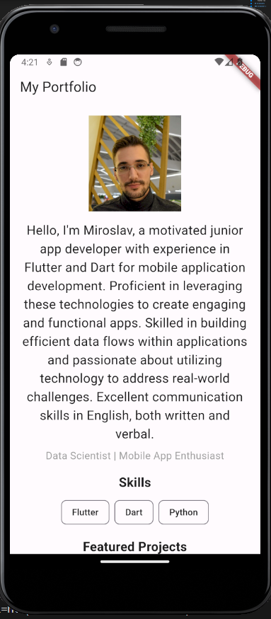
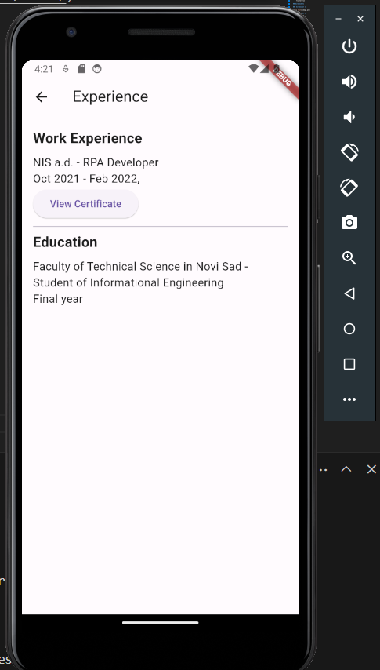

# My Portfolio App

This Flutter app showcases my portfolio with details about my skills, featured projects, and experience.

## How to Run

### Prerequisites

- [Flutter SDK](https://flutter.dev/docs/get-started/install)
- [Android Studio](https://developer.android.com/studio) or [Xcode](https://developer.apple.com/xcode/)

### Steps

1. Clone the repository:

   ```bash
   git clone https://github.com/your-username/your-portfolio-app.git
2. Navigate to the project directory:
    cd portfolioapp
3. Install dependencies
    flutter pub get
4. Run the app:
    flutter run

## Screenshots 

### Screenshot 1



### Screenshot 2

